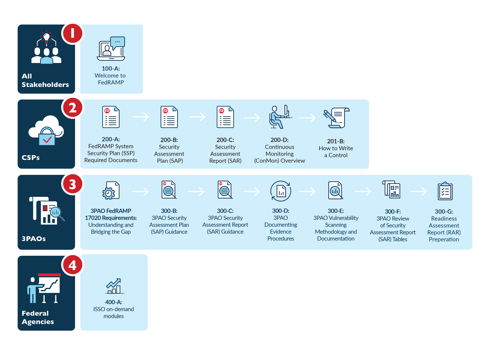

The FedRAMP PMO offers a series of online training courses to provide all stakeholders with a deeper understanding of FedRAMP and the level of effort that is required to successfully complete a FedRAMP assessment.

This series consists of free e-learning courses geared towards specific stakeholder groups. The FedRAMP PMO encourages everyone to take these trainings, as the courseware provides participants with a holistic view of the FedRAMP process.

To access the training platform: 
1. Follow this link: <a href="https://meet.gsa.gov/fedramp_training/event/event_info.html">"https://meet.gsa.gov/fedramp_training/event/event_info.html"</a>
2. Click on “Event Registration” in the top right of the menu bar
3. Fill out the user information to set up an account (password length must be between 16 and 32 characters) and click “View”
4. Click on your desired course within the FedRAMP Training Series Curriculum  

Once you have registered, you will recieve an e-mail confirmation and returning students can login via this link:<a href="https://meet.gsa.gov/fedramp_training/event/login.html">"https://meet.gsa.gov/fedramp_training/event/login.html"</a>

If you have any questions, comments, or concerns about the FedRAMP Training series, please send them to <a href="info@fedramp.gov">info@fedramp.gov</a> with the subject line: "Regarding FedRAMP Training."
## Learning Paths for All Populations, including CSPs, 3PAOs, and Agencies

<h2>Path 1: All Stakeholders</h2>
		<h3 class="accordion">100-A: Welcome to FedRAMP</h3>
		

		
The <a href="https://meet.gsa.gov/fedramp_training/event/event_info.html">"Welcome to FedRAMP Course"</a> provides an overview of the FedRAMP program. FedRAMP is a government-wide program that provides a standardized approach to security assessment, authorization, and continuous monitoring for cloud products and services. This one-hour introductory course in the FedRAMP Training Series is intended for Cloud Service Providers (CSPs) and Third Party Assessment Organizations (3PAOs) who aren’t well acquainted with FedRAMP. This course also serves as an excellent source of information for anyone in government or the private sector who wants to learn more about the program.

<strong>Duration:</strong> 1 hour

		

Download a <a href="{{site.baseurl}}/assets/resources/training/100-A-FedRAMP-Training-Welcome-to-FedRAMP.pdf">"PDF version"</a> of the "Welcome to FedRAMP" training course.

<h2>Path 2: Designed for CSPs and 3PAOs</h2>
		<h3 class="accordion">200-A: FedRAMP System Security Plan (SSP) Required Documents</h3>
			

			
<a href="https://meet.gsa.gov/fedramp_training/event/event_info.html">"FedRAMP System Security Plan (SSP) Required Documents"</a> course module provides CSPs with a deeper understanding of the detail and rigor required by the FedRAMP PMO. It will familiarize you with required documentation for initial package submission and give a detailed overview of FedRAMP’s SSP template and its supporting documents.

<strong>Duration:</strong> 1 hour

Download a <a href="{{site.baseurl}}/assets/resources/training/200-A-FedRAMP-Training-FedRAMP-System-Security-Plan-SSP-Required-Documents.pdf">PDF version</a> of the "FedRAMP System Security (SSP) Required Documents" training course.

<h3 class="accordion">200-B: Security Assessment Plan (SAP)</h3>

The <a href="https://www.youtube.com/watch?v=k4IfvfqrZic">"Security Assessment Plan (SAP)"</a> course module is designed to help FedRAMP Assessors understand how to write specific sections of these documents and the program’s reporting requirements.

<strong>Duration:</strong> 1 hour

Download a <a href="{{site.baseurl}}/assets/resources/training/200-B-FedRAMP-Training-Security-Assessment-Plan-SAP.pdf">PDF version</a> of the "Security Assessment Plan (SAP)" training course.

<h3 class="accordion">200-C: Security Assessment Report (SAR)</h3>

The <a href="https://meet.gsa.gov/fedramp_training/event/event_info.html">"Security Assessment Report (SAR)"</a> course module is designed to help FedRAMP Assessors understand how to write specific sections of these documents and the program’s reporting requirements.

<strong>Duration:</strong> 1 hour

Download a <a href="{{site.baseurl}}/assets/resources/training/200-C-FedRAMP-Training-Security-Assessment-Report-SAR.pdf">PDF version</a> of the "Security Assessment Report (SAR)" training course.

<h3 class="accordion">200-D: Continuous Monitoring (ConMon) Overview</h3>

The purpose of the <a href="https://meet.gsa.gov/fedramp_training/event/event_info.html">"ConMon Overview"</a> training module is to provide guidance on continuous monitoring and ongoing authorization in support of maintaining a security authorization that meets the FedRAMP requirements. This training module is structured for a CSP going through the JAB path with a Third Party Assessment Organization (3PAO), or a 3PAO, conducting an assessment of the Cloud System.

<strong>Duration:</strong> 1 hour

Download a <a href="{{site.baseurl}}/assets/resources/training/200-D-FedRAMP-Training-Continuous-Monitoring-ConMon-Overview.pdf">PDF version</a> of the "Continuous Monitoring (ConMon) Overview" training course.

<h3 class="accordion">201-B: How to Write a Control</h3>

The <a href="https://meet.gsa.gov/fedramp_training/event/event_info.html">"How to Write a Control"</a> course teaches a CSP how to properly write a control that will satisfy the program’s requirements. This training module is structured for a CSP pursuing a JAB authorization with a 3PAO, or a 3PAO, conducting an assessment of the cloud system.

<strong>Duration:</strong> 1 hour

Download a <a href="{{site.baseurl}}/assets/resources/training/201-B-FedRAMP-Training-How-to-Write-a-Control.pdf">PDF version</a> of the "How to Write a Control" training course.

<h2>Path 3: Designed for 3PAOs</h2>

<h3 class="accordion">300-A: 3PAO FedRAMP 17020 Requirements: Understanding and Bridging the Gap</h3>

	

The <a href="https://meet.gsa.gov/fedramp_training/event/event_info.html">"3PAO FedRAMP 17020 Requirements"</a> course provides 3PAOs with guidance on how FedRAMP requirements apply to ISO/IEC 17020:2012 which specifies requirements for the competence of bodies performing inspection and for the impartiality and consistency of their inspection activities.

	

This course provides a 3PAO with the FedRAMP requirements overlaid on ISO/IEC 17020.

<strong>Duration:</strong> 1 hour

<strong>Released:</strong> June 7th, 2018

Coming soon.

<h3 class="accordion">300-B: 3PAO Security Assessment Plan (SAP) Guidance</h3>

This course provides 3PAOs with guidance on FedRAMP requirements for creating a robust SAP.

<strong>Duration:</strong> 1 hour

Coming soon.

<h3 class="accordion">300-C: 3PAO Security Assessment Report (SAR) Guidance</h3>

This course provides 3PAOs with guidance on FedRAMP requirements for creating a robust SAR.

<strong>Duration:</strong> 1 hour

Coming soon.

<h3 class="accordion">300-D: 3PAO Documenting Evidence Procedures</h3>

This course provides 3PAOs with guidance on FedRAMP requirements for documenting evidence collected during the assessment and on how to populate the SAR.

Coming soon.

<h3 class="accordion">300-E: 3PAO Vulnerability Scanning Methodology and Documentation</h3>

This course describes the FedRAMP requirements for conducting vulnerability scanning on a system and teaches how to document results to meet FedRAMP requirements for initial authorization assessments and annual assessments.

<strong>Duration:</strong> 1 hour

Coming soon.

<h3 class="accordion">300-F: 3PAO Review of Security Assessment Report (SAR) Tables</h3>

This course provides 3PAOs with guidance on FedRAMP requirements for populating SAR tables to ensure that all tables are correctly populated.

<strong>Duration:</strong> 2 hours

Coming soon.

<h3 class="accordion">300-G: Readiness Assessment Report (RAR) Preparation</h3>

The <a href="https://meet.gsa.gov/fedramp_training/event/event_info.html">"300-G RAR Preparation "</a> course provides a discussion on how the FedRAMP security requirements must align with a CSP’s system security capabilities before the CSP system can be approved as FedRAMP Ready.

<strong>Duration:</strong> 1 hour

Download a <a href="{{site.baseurl}}/assets/resources/training/300-G_3PAO-Readiness-Assessment-Report-RAR-Preparation.pdf">PDF version</a> of the "Readiness Assessment Report (RAR) Preparation" training course.

